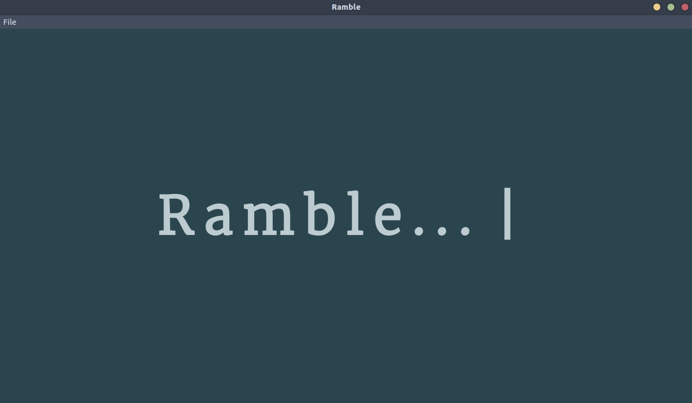

# Ramble
A simple tool for creating dialogs, cutscenes and stories.

Made, because I needed something simple to easily create and manage dialogs between one or more characters in a game.
This tool is still in production, lacking some smart and useful functionalities here and there (and goddamned tests!), but the core is done, should work fine for now...

### Features:
- Manage conversations
- Add/edit dialog nodes
- Create dialogs flow (connections between nodes)
- Manage characters and link dialog to specific character
- Export to JSON
- Absolutely magnificent (my mom said it's pretty, so it must be) UI

### Made with:

### License
Dunno, *Beerware*?
It's free to use, modify and do whatever you want, even without crediting me anywhere. 
